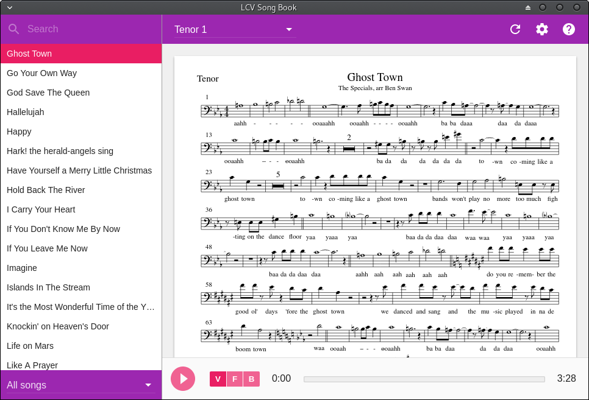

# LCV Song Book

## Install and run for development

You need [node](https://nodejs.org) installed first.

Install dependencies:

    > npm install

And start the app:

    > npm start

This will start the app and compile JS and CSS on the fly. You can open dev tools by hitting `Ctrl+Shift+I` or `Cmd+Opt+I` on a mac. Use `Ctrl+R` (`Cmd+R` on a mac) to reload the app.

## Build for your platform

Simply run:

    > npm run package

This will build the app into the `out` folder.
